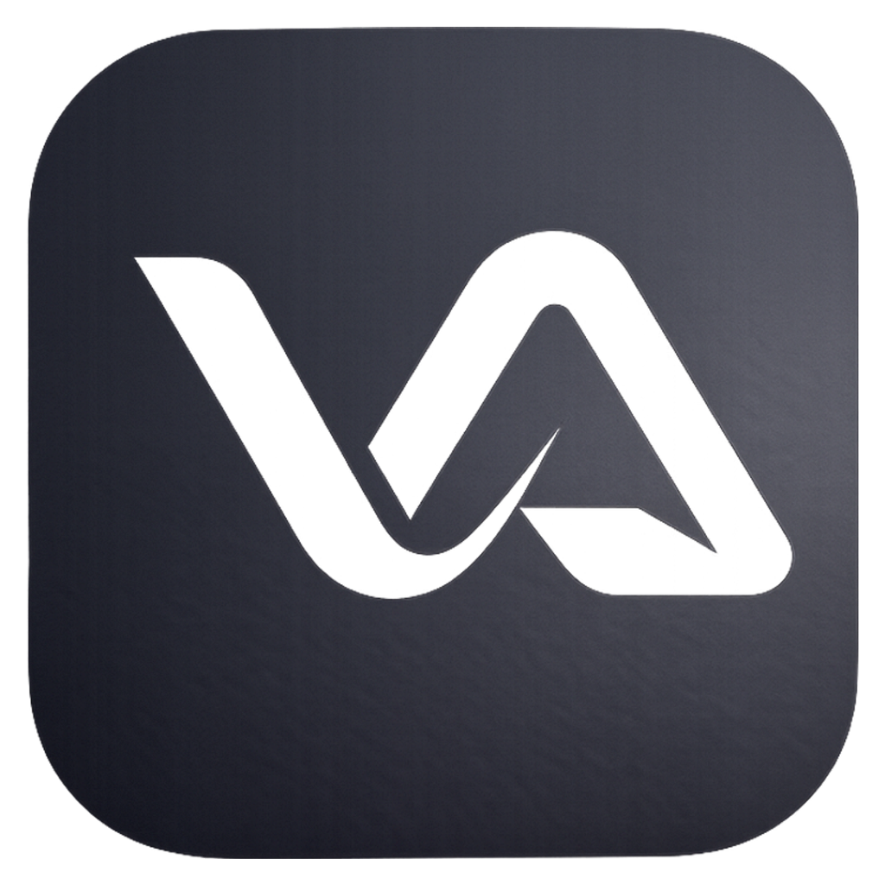

<div align="center">
  
  

  <br />

  <a href="https://git.io/typing-svg">
    
  </a>

  <br />

  [](https://github.com/Shlok0095/VeilAssist/releases/latest)
  [](https://veilassist.vercel.app)
  [](#requirements)
  [](https://www.electronjs.org/)
</div>

VeilAssist is a Windows Electron assistant for live meetings. It combines live transcription, screen understanding, conversational memory, and streaming AI responses in a discreet desktop overlay.

## Highlights

- Real-time microphone and system-audio transcription
- Multimodal screen analysis with automatic provider fallback
- Streaming answers, reusable profile modes, and follow-up memory
- Local-first meeting history and semantic recall
- Capture-protected overlay and configurable global hotkeys

The desktop application lives at the repository root. The independently built product website is in `landing/`.

## Requirements

- Windows 10 or later
- Node.js 20 or later

## Development

```powershell
npm ci
npm run dev
```

The application can stay active in the system tray after its overlay closes. Use the tray menu to show or quit it, or run `npm run start:force`.

## Commands

| Command | Purpose |
|---|---|
| `npm run dev` | Build and launch Electron with logging |
| `npm start` | Build and launch Electron |
| `npm run build` | Build all Electron renderer windows |
| `npm run test` | Run deterministic desktop tests and website type checking |
| `npm run verify` | Run all automated checks and both production builds |
| `npm run dist:dir` | Build an unpacked Windows application |
| `npm run dist:release` | Build portable and NSIS release executables |
| `npm run dev:web` | Start the website development server |
| `npm run build:web` | Build the website |

## Structure

```text
.
├─ main/                 Electron process and IPC orchestration
├─ lib/                  Desktop domain and infrastructure services
├─ renderer/             Overlay, settings, onboarding, and secondary windows
├─ scripts/              Tests, packaging, and release tools
├─ docs/user-guide/      Documentation bundled into the application
├─ legal/                Packaged legal documents
├─ landing/              Website package
└─ package.json          Desktop application and repository commands
```

See `docs/REPOSITORY_STRUCTURE.md` for ownership and packaging boundaries and `docs/LAUNCH_END_TO_END.md` for release operations.

## Release

Windows releases are built by `.github/workflows/release-windows.yml`. Keep the `package.json` version aligned with a release tag such as `v1.0.1`.

The website deploys from `landing/` through Vercel and GitHub Pages. Its download routes resolve to the rolling GitHub release assets.

## Default hotkeys

- `Ctrl+\` — toggle overlay
- `Ctrl+Enter` — ask AI
- `Ctrl+R` — clear chat
- `Ctrl+Shift+\` — toggle listening
- `Ctrl+Shift+S` — open settings
- `Ctrl+Arrow` — move overlay

Provider credentials are configured in onboarding or Settings.


