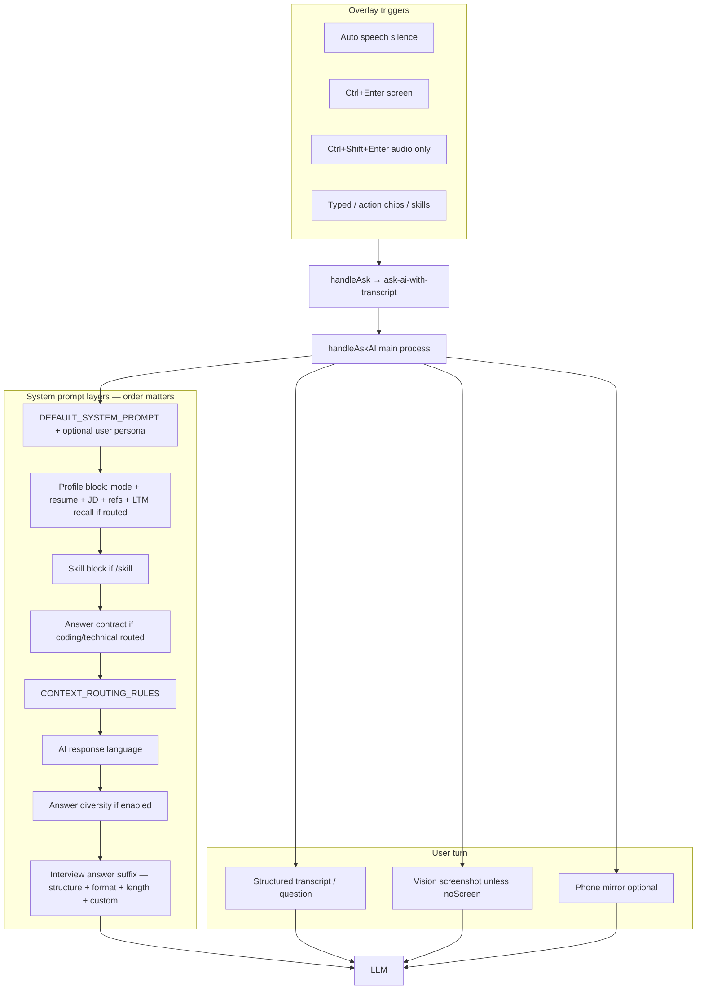

# VeilAssist — Settings, Behavior & Wiring Audit

> **Purpose:** Full map of every settings section, what it actually does at runtime, what is duplicated or conflicting, and what is wired vs inert. Use this to decide product logic changes.
>
> **Audit date:** 2026-08-22  
> **Scope:** Desktop Electron app (`main/`, `renderer/settings/`, `renderer/overlay/`, `lib/`)  
> **Companion docs:** [`PANEL_FUNCTIONALITY_AUDIT.md`](./PANEL_FUNCTIONALITY_AUDIT.md) (control-by-control UI audit), [`docs/DESKTOP_BEHAVIOR_WIRING.md`](./docs/DESKTOP_BEHAVIOR_WIRING.md) (Ask prompt stack)

---

## Executive summary

### Your question: “Smart features off, but answers still match my mode — correct?”

**Yes, that is expected.**

| Layer | Depends on Intelligence / LTM? | Always active when configured? |
|-------|-------------------------------|-------------------------------|
| **Profile mode** (Interview, Gen AI engineer, …) | No | Yes — `## ACTIVE PROMPT` + mode session rules on every Ask |
| **Resume / JD** (Profile tab) | Partially | Yes — static profile text is injected; routing only changes *how much* and *when* |
| **Answer structure / format / length** (General) | No | Yes — appended to system prompt every Ask |
| **Long-term memory recall** | Yes | Only when routing on + backward-looking query |
| **Past-meeting search** | Yes (advanced flag) | Only when enabled + user searches |

So answers mentioning **SoftSensor.ai**, **first-person interview tone**, or **CAR/Conversational shape** with Intelligence **off** are still correct — they come from **mode + resume + General answer settings**, not from LTM.

### Top surprises (read these first)

1. **“Enable smart features” OFF ≠ minimal context.** It disables *selective* routing and injects **more** resume/JD/reference content on every Ask (`useAll = true`).
2. **Interview mode hard-codes STAR** in session rules while General lets you pick **CAR** — both apply; the model merges them (can feel redundant).
3. **`answerStyle` (brief/detailed)** affects **overlay layout only**; LLM shape is driven by **`responseFormat`** + interview suffix. Old “Response style” in user-guide docs is stale.
4. **“Answer history: Latest only”** is saved and synced to overlay state but **not consumed** by `ResponsePanel` — UI always shows full thread.
5. **General vs Advance** split overlay controls across two tabs (opacity/font in General; teleprompter/size in Advance).

---

## How every Ask is built (runtime pipeline)



**Key files:** `main/index.js` (`handleAskAI`, `buildProfileContextBlock`), `renderer/overlay/App.jsx` (`handleAsk`), `lib/interviewAnswerPrompt.cjs`, `lib/contextPrompts.js`, `lib/contextRouter.js`.

---

## Settings navigation map

| Tab | File | What it controls |
|-----|------|------------------|
| **Profile** | `ProfileSettingsPanel.jsx` | Modes, resume, JD, skills |
| **General** | `DisplaySettingsPanel.jsx` | Overlay look, answer format, interview session, startup/privacy |
| **Keybinds** | `KeybindsSettingsPanel.jsx` | Global shortcuts |
| **Meeting** | `MeetingsSettingsPanel.jsx` | Google Calendar, session recaps |
| **Advance** | `AdvanceSettingsPanel.jsx` | AI providers, Audio/STT, Phone, Intelligence, Overlay fine-tune |
| **Privacy** | `PrivacySettingsPanel.jsx` | Export / delete data |
| **Help** | `HelpSettingsPanel.jsx` | FAQ, guide, logs |
| **About** | `AboutSettingsPanel.jsx` | Version info |

Legacy tab IDs (`ai`, `speech`, `intelligence`, …) redirect to **Advance** via `settingsNav.jsx`.

---

## Section-by-section audit

Legend: **WIRED** · **PARTIAL** · **INERT** (persisted, no runtime effect) · **WEIRD** (works but counter-intuitive) · **DUP** (duplicated control or logic)

---

### 1. Profile → Modes & background

| Control | Store / IPC | Runtime consumer | Status | Notes |
|---------|-------------|------------------|--------|-------|
| Active mode picker (overlay + settings) | `activeContextPromptId`, `contextPrompts` | `formatActivePromptBlock`, `formatModeSessionRules` | **WIRED** | Drives first-person interview rules, sales, meeting, etc. |
| Mode prompt text | `contextPrompts[].content` | Same | **WIRED** | “Interview” default: speak as candidate, use resume |
| Reference files per mode | `contextPrompts[].referenceFiles` | `buildProfileContextBlock` | **WIRED** | Vector index if `referenceVectorIndexEnabled` |
| Notes template | `contextPrompts[].notesTemplate` | Injected when mode layer selected | **WIRED** | Mostly for meeting/recruiting notes |
| Resume / JD text | `resumeContext`, `jdContext` | `## RESUME / BACKGROUND`, `## JOB DESCRIPTION` | **WIRED** | Parsed to `resumeTree` / `jdTree` on save |
| Mode templates | — | Creates new `contextPrompts` entry | **WIRED** | `lib/modeTemplates.cjs` |

**WEIRD / DUP:**

- **STAR in mode rules vs CAR in General:** `formatModeSessionRules` (interviewee) says “Behavioral: STAR in 4 sentences.” General **Answer structure** can be CAR/SOAR/PAR. Both land in the prompt — suffix is appended *last* but mode rules also claim priority. Expect overlap, not strict CAR labeling.
- **Interview mode + resume:** Mode rules say “use reference files / resume”; routing off still injects full resume every time.
- **Unsaved mode draft:** Switching mode without Save can lose edits or save to wrong mode ([`PANEL_FUNCTIONALITY_AUDIT.md`](./PANEL_FUNCTIONALITY_AUDIT.md) §2).

---

### 2. Profile → Skills

| Control | Persistence | Runtime | Status |
|---------|-------------|---------|--------|
| Create/edit/delete skill | Files under `userData/skills/` | `skills:buildSkillBlock` in `handleAskAI` | **WIRED** |
| `/skill-name` in overlay | — | `parseSkillInvoke` in `App.jsx` | **WIRED** |

Skills are **independent** of Intelligence flags and modes (unless skill text contradicts mode).

---

### 3. General → Startup

| Control | Store key | Consumer | Status |
|---------|-----------|----------|--------|
| Open at login | `openAtLogin` | Main process login item | **WIRED** |

---

### 4. General → Privacy & retention

| Control | Store key | Consumer | Status | Notes |
|---------|-----------|----------|--------|-------|
| Do not save meetings | `doNotSaveMeetingsEnabled` | `finalizeMeetingSession` skip | **WIRED** | Blocks recaps + LTM retain on session end |
| Hide from screen capture | `stealth_mode` | `setContentProtection` on windows | **WIRED** | Windows: WDA_EXCLUDEFROMCAPTURE |

**WEIRD:** Stealth hides overlay from capture; Ask still captures desktop *behind* overlay via `withOverlayExcludedFromScreenCapture` wrapper.

---

### 5. General → Diagnostics

| Control | Store key | Consumer | Status |
|---------|-----------|----------|--------|
| Verbose debug logging | `verboseDebugLogging` | `lib/debugLog.js` | **WIRED** |
| Open log file | — | `debug-log:open-file` IPC | **WIRED** |

**PARTIAL:** Settings toast for verbose mode broken (payload handling) per panel audit.

---

### 6. General → Overlay appearance & behavior

| Control | Store key | Consumer | Status | Notes |
|---------|-----------|----------|--------|-------|
| Accent color | `uiAccentTheme` | Overlay CSS via `ui-accent-update` | **WIRED** |
| Mouse passthrough | `overlayMousePassthroughEnabled` | `syncOverlayMouseCapture` | **WIRED** |
| Hide from taskbar | `hideFromTaskbarEnabled` | `applyTaskbarVisibility` | **PARTIAL** | Launcher may not follow stealth/taskbar rules |

**DUP:** Opacity, font, transcript toggles are here; teleprompter/focus/size are under **Advance → Overlay**.

---

### 7. General → Answers & screenshots

| Control | Store key(s) | LLM prompt | Overlay display | Status |
|---------|--------------|------------|-----------------|--------|
| Custom instructions | `interviewCustomInstructions` | Yes — suffix | No | **WIRED** |
| Answer structure | `answerStructure` | Yes — `structurePrompt()` | No | **WIRED** |
| Response format | `responseFormat` | Yes — `formatPrompt()` + override block | Derives `answerStyle` | **WIRED** |
| Answer length | `answerLength` | Yes — word target + `maxTokens` | Font if auto-scroll on | **WIRED** |
| Response language | `aiResponseLanguage` | Yes — language block | No | **WIRED** |
| Conversation follow-ups | `conversationFollowUpsEnabled` | Yes — `resolveConversationFollowUp` | No | **WIRED** (default off) |
| Answer history | `overlayAnswerView` | No | **INERT** | State loaded in `App.jsx`, never passed to `ResponsePanel` |

**Format → display mapping (`lib/interviewSettingsCatalog.cjs`):**

| `responseFormat` | Prompt behavior | Overlay `answerStyle` |
|------------------|-----------------|------------------------|
| `bullets` | Bullet interview override | `brief` (Takeaway shell) |
| `conversational` | Spoken + fillers (`Hmm`, …) | `detailed` |
| `example` | Point + example, no fillers | `detailed` |

**WEIRD / conflicts:**

| Combo | What happens |
|-------|----------------|
| Conversational + coding on screen | Spoken override fights `<technical_problems>` (full code + Takeaway) — answers may lack code or use wrong tone |
| CAR + Interview mode | Mode says STAR; suffix says CAR — model improvises blended prose |
| Custom instructions + format override | All appended; last suffix blocks win on conflict — custom line is *before* override tail |

**DUP / stale:**

- `answerStyle` store key is **display-only**, auto-set from `responseFormat`. No separate UI (good). User-guide still mentions “Response style” under AI Providers — **docs stale**.
- `lib/answerStyle.js` (`getAnswerStyleSuffix`) — **dead for Ask path**; replaced by `getInterviewAnswerSuffixFromStore`.

---

### 8. General → Interview session

| Control | Store key | Consumer | Status | Notes |
|---------|-----------|----------|--------|-------|
| Auto-answer questions | `assistAutoTrigger` | `maybeTriggerAI` in overlay | **WIRED** | Requires Listen ON |
| Question detection | `questionDetection` | `minCharsForDetection` / utterance gates | **WIRED** | low / medium / high char thresholds |
| Auto-scroll answers | `overlayAnswerAutoScroll` | `ResponsePanel` scroll | **WIRED** | Couples font to `answerLength` when enabled |

**WEIRD:** Auto-answer uses `promptMode: audio` (speech-led). Screen is attached if vision supported, but **not screen-led** unless you use **Ctrl+Enter**. Technical questions visible only on screen need manual screen ask.

---

### 9. General → Overlay (chrome)

| Control | Store key | Consumer | Status |
|---------|-----------|----------|--------|
| Opacity | `overlayOpacity` | Overlay window | **WIRED** |
| Font size | `overlayFontSize` | `ResponsePanel` | **WIRED** | Auto-overridden when auto-scroll + answer length |
| Live transcript panel | `overlayLiveTranscriptEnabled` | Overlay transcript UI | **WIRED** |
| Auto-scroll transcript | `overlayTranscriptAutoScroll` | Transcript panel | **WIRED** |
| Pin answers to top | `overlayAnswerPinToTop` | Scroll behavior | **WIRED** |
| Snap position presets | `overlayBounds` | Window position IPC | **WIRED** |

---

### 10. Advance → AI Providers

| Control | Store keys | Consumer | Status |
|---------|------------|----------|--------|
| Provider + API keys + models | `provider`, `*Key`, `*Model`, `customOpenaiBaseUrl` | `handleAskAI`, STT routing | **WIRED** |
| Test connection / sync models | — | `test-api`, `list-remote-models` | **WIRED** |
| First-run setup banner | `hasCompletedOnboarding` | Onboarding flow | **PARTIAL** | Onboarding window unreachable per panel audit |

**INERT / no UI:** `systemPrompt` is read in Ask but has **no settings editor** (only built-in + optional legacy store value).

---

### 11. Advance → Audio

| Control | Store key | Consumer | Status | Notes |
|---------|-----------|----------|--------|-------|
| Audio enabled | `audioEnabled` | Listen start gate | **PARTIAL** | Turning off mid-session does not stop active capture |
| Mic sensitivity | `micSensitivity` | Gain profile + overlay | **WIRED** |
| Meeting / listen language | `meetingListenLanguage` | Syncs `micListenLanguage` → STT | **WIRED** |
| Mic device | `preferredMicId` | Overlay `getUserMedia` | **WIRED** |
| **Speaker device** | `preferredSpeakerId` | — | **INERT** | Saved in UI, **never read** in main or overlay |
| STT mode local/cloud | `sttMode` | Transcription routing | **WIRED** |
| STT provider + keys/models | many `*Key`, `*Model` | Cloud STT backends | **WIRED** |

**DUP:** `deepgramModel`, `azureSpeechRegion`, `sonioxModel` appear in main STT block **and** Advanced STT keys collapsible (`SpeechSettingsPanel.jsx`).

---

### 12. Advance → Phone

| Control | Store key | Consumer | Status |
|---------|-----------|----------|--------|
| Phone Link enable | `phoneLinkEnabled` | `phoneLinkManager` | **WIRED** |
| Remote mic | `phoneLinkRemoteMicEnabled` | Phone mic ingest | **WIRED** |
| Mirror device / size | `phoneMirrorDeviceId`, `phoneMirrorMaxSize` | scrcpy | **WIRED** |
| Include phone in Ask | `phoneMirrorIncludeInAsk` | Second vision image in Ask | **WIRED** |

**No UI:** `phoneLinkPort`, `phoneMirrorBitRate` — hardcoded defaults in lib.

---

### 13. Advance → Intelligence

#### Master: Enable smart features

Toggles all **core** flags together (`lib/intelligenceFlags.js` → `CORE_FLAG_KEYS`):

| Flag | Store key | Default | Ask impact | Overlay impact |
|------|-----------|---------|------------|----------------|
| Smart context routing | `intelligenceRoutingEnabled` | on | Selective resume/JD/refs; enables LTM recall path | — |
| Long-term memory | `longTermMemoryEnabled` | on | Retain on session end; recall when routed | — |
| Auto-detect meeting type | `meetingModeAutoDetectEnabled` | on | Mode suggestion during Listen | Suggestion chip |
| Stronger candidate voice | `profileTreeV2Enabled` | on | Resume/JD tree + evidence retrieval | — |

**WEIRD — routing OFF:**

```text
resolveContextRouteDecision() → null
buildProfileContextBlock() → useAll = true
→ mode + resume + JD + references on EVERY ask
→ NO hindsight/LTM recall block (requires routingOn)
```

So “smart features off” = **more static profile**, **less** past-meeting recall — opposite of what many users expect.

#### Customize (advanced flags)

| Flag | Store key | Default | Ask impact |
|------|-----------|---------|------------|
| Smart follow-up drafts | `followUpDraftEnabled` | off | Meeting recap modal only |
| Vector memory | `vectorMemoryEnabled` | on | Softer vector gate in hybrid recall |
| Search past meetings | `globalMeetingSearchEnabled` | off | Overlay search pill |
| Answer diversity | `answerDiversityEnabled` | off | Extra STYLE hint in system prompt |
| Reference file vectors | `referenceVectorIndexEnabled` | off | Embedding retrieval for playbooks |

#### Persistent recall (Hindsight)

| Control | Store keys | Status | Notes |
|---------|------------|--------|-------|
| Recall provider | `hindsightProvider` | **WIRED** | off / gateway / hindsight |
| API URL / key | `hindsightApiUrl`, `hindsightApiKey` | **WIRED** | |
| Auto-start local gateway | `hindsightAutoStartEnabled` | **PARTIAL** | Enabling sets provider to `gateway`; disabling does not fully reset provider |
| Clear LTM | — | **WIRED** | `long-term-memory:clear` IPC |

**WEIRD:** `followUpDraftEnabled` toggle is only under Intelligence; Meeting tab reads it for recap modal tooltip only.

---

### 14. Advance → Overlay

| Control | Store key | Consumer | Status |
|---------|-----------|----------|--------|
| Teleprompter | `overlayTeleprompter` | `ResponsePanel` layout | **WIRED** |
| Focus mode | `overlayFocusMode` | Hides input until tap | **WIRED** |
| Panel width/height | `overlayBounds` | Window resize | **WIRED** |

**DUP:** Split with General overlay section (see §6, §9).

---

### 15. Keybinds

| Control | Persistence | Consumer | Status |
|---------|-------------|----------|--------|
| 16 shortcut fields | `hotkeys` object | `lib/hotkeys.js` | **PARTIAL** | Plain text fields; no capture UI; conflicts possible |

Critical shortcuts for behavior:

| Action | Default | Effect |
|--------|---------|--------|
| `askAI` | Ctrl+Enter | Pre-capture screen + screen-led ask |
| `askAINoScreen` | Ctrl+Shift+Enter | Audio/text only |
| `toggleSession` | (configured) | Listen on/off |
| `followUp` | (configured) | Continue same session |

---

### 16. Meeting

| Control | Store key | Status | Notes |
|---------|-----------|--------|-------|
| Google Calendar OAuth | `googleCalendar*` | **PARTIAL** | OAuth “ready” can be true with only client ID |
| Reminders | `calendarRemindersEnabled`, `calendarReminderMinutes` | **WIRED** | |
| Meeting app detection | `meetingForegroundDetectionEnabled` | **WIRED** | Foreground window hints |
| Session recaps | `meetingSessions` data | **WIRED** | Feeds LTM retain when allowed |
| Follow-up draft in modal | `followUpDraftEnabled` | **WIRED** | Toggle not on this tab |

**INERT prop:** `selectedCalendarDate` passed from App but unused in Meetings panel.

---

### 17. Privacy

| Control | Status | Notes |
|---------|--------|-------|
| Export data | **WIRED** | `export-user-data` |
| Delete all data | **PARTIAL** | Clears electron-store only; skills, vector DB, logs may remain ([panel audit P0](./PANEL_FUNCTIONALITY_AUDIT.md)) |

---

### 18. Help & About

Display-only + IPC to open logs/guide. No Ask impact.

---

## Overlay-only controls (not in Settings)

| Control | Store / behavior | Status |
|---------|------------------|--------|
| Mode picker pill | Writes `activeContextPromptId` | **WIRED** |
| Listen toggle | Session start/stop | **WIRED** |
| Action chips (Clarify, Follow up, …) | `handleAsk` with preset prompts | **WIRED** |
| Past meeting search pill | `globalMeetingSearchEnabled` + IPC search | **WIRED** when flag on |

---

## Duplication & conflict matrix

| Issue | Locations | Severity | Recommendation |
|-------|-----------|----------|----------------|
| STAR (mode) vs CAR/SOAR (General) | `contextPrompts.js` vs `interviewSettingsCatalog.cjs` | Medium | Derive mode rules from `answerStructure` or drop STAR from mode text |
| Conversational vs coding contract | suffix override vs `defaultSystemPrompt` technical block | High | Skip spoken override when `coding_answer` contract active |
| Smart routing OFF = more profile | `buildProfileContextBlock` | High | Document clearly; consider `useAll=false` minimal mode |
| `answerStyle` vs `responseFormat` | store + overlay | Low | Keep derived; remove stale docs references |
| Overlay settings split | General + Advance | Low | UX consolidation |
| STT model fields duplicated | `SpeechSettingsPanel` | Low | Single source in UI |
| `preferredSpeakerId` | Audio settings | Medium | Wire to output device or remove UI |
| `overlayAnswerView` | General + App.jsx | Medium | Implement filter in `ResponsePanel` or remove control |
| `lib/answerStyle.js` | dead code | Low | Delete or repurpose |
| User-guide “Response style” | `docs/user-guide/05`, `07` | Low | Update to Response format |

---

## Alignment guide — what to use when

| Your goal | Mode | General settings | Intelligence | Trigger |
|-----------|------|------------------|--------------|---------|
| Live behavioral interview | Interview | CAR/STAR + Conversational or Example | Routing on (default) | Listen + auto |
| Technical Q&A spoken | Gen AI engineer | Bullets or Example, Medium/Long | Routing on | Listen or typed |
| LeetCode / screen coding | Gen AI engineer | **Bullets**, Long | Any | **Ctrl+Enter** |
| Anonymous / no resume | General mode, clear resume | Any | Routing on | — |
| Minimal context / cheap tokens | Any | Any | **Routing on** (not off!) | — |
| Recall last week’s meeting | Any | Any | LTM on + routing on | Ask backward-looking question |

---

## Automated verification

```bash
node scripts/test-desktop-interview-wiring.cjs
node scripts/test-general-answer-settings-wiring.cjs
node scripts/test-ask-context-priority.cjs
node scripts/test-stream-answer-display.cjs
```

Static panel audit evidence: see [`PANEL_FUNCTIONALITY_AUDIT.md`](./PANEL_FUNCTIONALITY_AUDIT.md).

---

## Suggested logic changes (product backlog)

Priority-ordered from this audit:

1. **Fix `overlayAnswerView`** — filter turns in `ResponsePanel` or remove setting.
2. **Clarify or fix routing-OFF behavior** — “plain mode” should not dump full resume every time if user expects minimal context.
3. **Unify interview structure** — single source: General `answerStructure` should update mode session rules text.
4. **Coding + Conversational guard** — disable spoken override when screen coding contract applies.
5. **Remove or wire `preferredSpeakerId`**.
6. **Update user-guide** — remove Brief/Detailed under AI Providers; document Response format.
7. **Delete or archive `lib/answerStyle.js`** if no imports remain.

---

## Glossary

| Term | Meaning |
|------|---------|
| **Mode** | Profile prompt — role (interviewee, seller, …) |
| **Answer settings** | Structure / format / length / custom instructions (General) |
| **Routing** | Per-question choice of which profile layers to inject |
| **LTM** | Long-term memory — past session summaries on disk |
| **Suffix** | Interview rules appended last to system prompt |
| **useAll** | Profile block path when routing is disabled — include all static layers |

---

## File index (quick navigation)

| Topic | Path |
|-------|------|
| Ask handler | `main/index.js` |
| Profile context | `main/index.js` → `buildProfileContextBlock` |
| Mode rules | `lib/contextPrompts.js` |
| Route planner | `lib/answerPlanner.js`, `lib/contextRouter.js` |
| Answer suffix | `lib/interviewSettingsCatalog.cjs` |
| Intelligence flags | `lib/intelligenceFlags.js` |
| Settings hub | `renderer/settings/App.jsx` |
| Overlay session | `renderer/overlay/App.jsx` |
| Store schema | `lib/store.js` |
