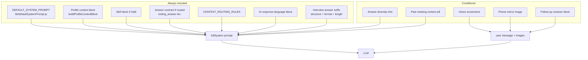

# VeilAssist Desktop — Behavior, Alignment & Wiring Reference

> **Purpose:** Explain what controls answers when modes, answer settings, and Intelligence toggles are on/off — so you can decide whether current logic is correct or needs changes.
>
> **Last reviewed:** 2026-08-22 (branch `veilassist-interview-1.0.24` area)

---

## Short answer to your question

**Yes — it is correct (by design) that answers still feel “mode-aware” and “resume-related” even when Intelligence / memory features are off.**

| Layer | Works when smart features OFF? | Why you still see Interview + resume examples |
|-------|-------------------------------|-----------------------------------------------|
| **Active mode** (e.g. Interview) | **Yes — always** | Injected on every Ask via `## ACTIVE PROMPT` + `MODE SESSION RULES` |
| **Resume / JD text** (Settings → Profile) | **Often yes** | Smart routing **off** actually includes **more** profile context, not less |
| **Answer structure / format / length** (General) | **Yes — always** | Appended to system prompt on every Ask |
| **Long-term memory recall** | **No** | Requires routing + backward-looking query |
| **Past-meeting vector search** | **No** (unless advanced flag on + query matches) | Gated by routing flags |
| **Auto mode suggestions** | **No** | `meetingModeAutoDetectEnabled === false` |

Your screenshot (“max pooling”, “ensemble techniques” + **SoftSensor.ai** example) matches **Interview mode + resume/profile in context + Conversational/CAR suffix** — not long-term memory.

---

## What goes into every Ask (prompt stack)

Every overlay Ask (`ask-ai-with-transcript` → `handleAskAI` in `main/index.js`) builds the model request in this order:



### 1. Built-in system prompt (always)

**File:** `lib/defaultSystemPrompt.js` → `resolveSystemPrompt(store.systemPrompt)`

Includes `<core_identity>`, `<candidate_voice>`, `<execution_contract>`, `<technical_problems>`, etc.

- **Interviewee behavior** is baked in here too (first person, resume for “tell me about yourself”).
- Optional **user persona supplement** from Settings is appended if non-empty.

### 2. Active profile mode (almost always)

**Files:** `lib/contextPrompts.js`, `main/index.js` → `buildProfileContextBlock`

When a mode like **Interview** is selected in the overlay picker:

```
## ACTIVE PROMPT (Interview)
I am in a job interview as the interviewee...
```

Plus **`## MODE SESSION RULES — INTERVIEW`** (first person, speakable answers, STAR for behavioral, code if screen shows coding, use reference files, etc.).

**Wiring:**

| Store key | UI |
|-----------|-----|
| `activeContextPromptId` | Overlay mode picker |
| `contextPrompts[]` | Settings → Profile modes |

`formatActivePromptBlock()` + `formatModeSessionRules()` run whenever `useAll || routeDecision.useActiveMode`.

### 3. Resume / JD / reference files

**Files:** `main/index.js` → `buildProfileContextBlock`, `lib/contextRouter.js`, `lib/answerPlanner.js`

| Intelligence routing | `routeDecision` | Profile injection |
|---------------------|-----------------|-------------------|
| **ON** (`intelligenceRoutingEnabled !== false`) | Computed per question | **Selective** — resume/JD/refs only when planner says relevant |
| **OFF** | `null` → `useAll = true` | **Broad** — mode + resume + JD + reference files + knowledge base (if present) on **every** Ask |

> **Important:** Turning off “Smart context routing” does **not** mean “ignore my resume.” It means “stop being selective” and include static profile blocks more aggressively.

**Stronger candidate voice** (`profileTreeV2Enabled`, default on):

- Uses structured resume/JD trees + optional embedding retrieval.
- Adds `buildProfileTreeV2VoiceGuard()` when resume/JD blocks are present (anti-hallucination + first-person rules).
- For interview/meeting **domains** (when routing is on), V2 voice is forced even if the toggle is off.

### 4. Interview answer settings (General tab — always on Ask)

**Files:** `lib/interviewSettingsCatalog.cjs`, `lib/interviewAnswerPrompt.cjs`, `main/index.js` line ~2839

| Store key | UI label | Prompt effect |
|-----------|----------|---------------|
| `answerStructure` | Answer structure (STAR/CAR/…) | `structurePrompt()` line in suffix |
| `responseFormat` | Bullet / Conversational / Example-Driven | `formatPrompt()` + mode override block |
| `answerLength` | Short / Medium / Long | Word target + `maxTokensForAnswerLength()` |
| `interviewCustomInstructions` | Custom instructions | Appended to suffix |
| `aiResponseLanguage` | Response language | Separate language block |

**Also affects overlay display (not the LLM):**

| `responseFormat` | `answerStyle` saved | Overlay layout |
|------------------|---------------------|----------------|
| `bullets` | `brief` | Takeaway + bullets shell |
| `conversational` / `example` | `detailed` | Full markdown / prose shell |

**Format overrides (suffix tail — wins over generic markdown when conflicting):**

| Format | Override block |
|--------|----------------|
| Conversational | `SPOKEN INTERVIEW MODE` — fillers (Hmm…), no Takeaway headings |
| Example-Driven | `INTERVIEW ANSWER MODE — EXAMPLE-DRIVEN` — point + example, no fillers |
| Bullets | `INTERVIEW ANSWER MODE — BULLETS` — short bullets for non-coding |

### 5. Intelligence / memory (conditional)

**Registry:** `lib/intelligenceFlags.js`

#### Master switch: “Enable smart features”

**UI:** Settings → Intelligence → Enable smart features  
**Wiring:** `renderer/settings/IntelligenceSettingsPanel.jsx` → sets all **core** flag store keys together:

| Core flag | Store key | Default |
|-----------|-----------|---------|
| Smart context routing | `intelligenceRoutingEnabled` | `true` |
| Long-term memory | `longTermMemoryEnabled` | `true` |
| Auto-detect meeting type | `meetingModeAutoDetectEnabled` | `true` |
| Stronger candidate voice | `profileTreeV2Enabled` | `true` |

#### Long-term memory (past meetings)

**Files:** `lib/longTermMemory.js`, `main/index.js` → `finalizeMeetingSession`, `hindsight.hybridRecall`

| When | Behavior |
|------|----------|
| Session ends (Listen off) | `longTermMemory.retain()` **if** `longTermMemoryEnabled !== false` |
| On Ask | Recall **only if** routing is on **and** `routeDecision` requests `useHindsightRecall` / `useMeetingSummary` / `useHybridRag` **and** query is backward-looking |

**Not** what powers “at SoftSensor.ai I implemented…” in a live technical answer — that comes from **resume text** in Profile.

#### Advanced flags (Customize section)

| Flag | Store key | Effect |
|------|-----------|--------|
| Vector memory | `vectorMemoryEnabled` | Semantic recall; keyword fallback always exists |
| Search past meetings | `globalMeetingSearchEnabled` | Overlay search pill |
| Answer diversity | `answerDiversityEnabled` | Extra STYLE hint in system prompt |
| Reference file vectors | `referenceVectorIndexEnabled` | Embedding retrieval for playbook chunks |
| Smart follow-up drafts | `followUpDraftEnabled` | Calendar follow-up generation |

#### Same-session follow-ups (separate from LTM)

| Store key | Default | Effect |
|-----------|---------|--------|
| `conversationFollowUpsEnabled` | `false` | `resolveConversationFollowUp()` — pronoun / “tell me more” resolution within overlay session |

---

## Overlay trigger wiring (what context is attached)

**File:** `renderer/overlay/App.jsx` → `handleAsk`, `lib/askContextPriority.cjs`

| Trigger | `promptMode` | Screen capture | Primary context |
|---------|--------------|----------------|-----------------|
| Auto-answer (speech silence) | `audio` | Yes if provider supports vision & `noScreen` false | Transcript-led; screen is supplementary |
| **Ctrl+Enter** | `screen` (if no competing speech) | Yes (pre-capture on hotkey) | Screen-led |
| **Ctrl+Shift+Enter** | `audio` | **No** (`noScreen: true`) | Audio/text only |
| Typed question + Enter | `typed` | Optional | Typed question primary |
| Action chips | typed + screen | Yes (`noScreen: false`) | Chip prompt |

**Session gate:** Listen toggle must be **ON** for overlay Ask/hotkeys (except global chat).

---

## Alignment matrix — mode × answer settings × task type

Use this to decide if your **settings match the task**.

| Task type | Recommended mode | Answer structure | Response format | Trigger |
|-----------|------------------|------------------|-----------------|---------|
| Behavioral interview (spoken) | Interview / Looking for work | CAR or STAR | Conversational or Example-Driven | Listen + auto or mic |
| Technical concept (“what is max pooling?”) | Interview or Gen AI engineer | Any (structure applies weakly) | Example-Driven or Bullets | Speech or typed |
| Live coding on screen | Gen AI engineer | N/A | **Bullet Points** | **Ctrl+Enter** (screen-led) |
| “What did we decide last week?” | Any | Any | Any | Needs **LTM + routing ON** |
| Meeting notes / recap | Team meet | N/A | Bullets | Listen → Stop session |

### Known tensions (current logic)

| Combination | What happens | Recommendation |
|-------------|--------------|----------------|
| Interview + Conversational + coding on screen | Spoken override fights `<technical_problems>` (Takeaway + full code) | Use Bullets + technical mode + Ctrl+Enter |
| CAR + pure definition question | Model may still add “for example at {employer}…” from resume | Expected in Interview mode with resume loaded |
| Smart routing OFF | More resume/JD every Ask; **no** LTM recall | Good for “always use my background”; bad for token noise |
| Smart routing ON | Less resume noise; adds recall for backward questions | Default for production |

---

## Your screenshot explained

**Settings observed:** Interview mode, CAR, Conversational, Medium, Intelligence toggles off.

**Question:** “what is max pooling layer?”  
**Answer shape:** Definition + CNN example + first-person resume tie-in — **correct for Interview mode with resume in profile**, regardless of LTM.

**Question:** “what are the ensemble techniques…”  
**Answer mentions SoftSensor.ai** — almost certainly from `resumeContext` / resume tree retrieval, **not** from long-term memory (routing off blocks hindsight recall path).

**Why CAR / Conversational still show:**

- CAR is in the **interview answer suffix** (appended every Ask).
- Conversational adds **spoken override** (fillers, first-person flow).
- Interview **MODE SESSION RULES** also say behavioral → STAR (4 sentences) — CAR suffix and mode rules can overlap; the model merges them.

---

## Store keys quick reference

### Profile & mode

| Key | Purpose |
|-----|---------|
| `contextPrompts` | All mode definitions |
| `activeContextPromptId` | Selected overlay mode |
| `resumeContext` | Resume text |
| `jdContext` | Job description |
| `resumeTree` / `jdTree` | Parsed structure for V2 voice |
| `knowledgeBase` | Legacy global reference (fallback if no ref files) |

### General answer settings

| Key | Default |
|-----|---------|
| `answerStructure` | `star` |
| `responseFormat` | `bullets` |
| `answerLength` | `medium` |
| `interviewCustomInstructions` | `''` |
| `aiResponseLanguage` | match question |
| `answerStyle` | derived from `responseFormat` |
| `assistAutoTrigger` | user preference |
| `questionDetection` | `high` |

### Intelligence

| Key | Default |
|-----|---------|
| `intelligenceRoutingEnabled` | `true` |
| `longTermMemoryEnabled` | `true` |
| `meetingModeAutoDetectEnabled` | `true` |
| `profileTreeV2Enabled` | `true` |
| `vectorMemoryEnabled` | `true` |
| `answerDiversityEnabled` | `false` |
| `conversationFollowUpsEnabled` | `false` |
| `hindsightProvider` | `off` |

---

## Code map (main wiring files)

| Concern | Primary files |
|---------|---------------|
| Ask pipeline | `main/index.js` → `handleAskAI`, `buildProfileContextBlock` |
| Overlay session + auto-answer | `renderer/overlay/App.jsx` |
| Mode prompts & session rules | `lib/contextPrompts.js` |
| Question → context layers | `lib/answerPlanner.js`, `lib/contextRouter.js` |
| Answer shape suffix | `lib/interviewSettingsCatalog.cjs`, `lib/interviewAnswerPrompt.cjs` |
| LTM retain/recall | `lib/longTermMemory.js`, `lib/hindsightClient.js` |
| Intelligence UI | `renderer/settings/IntelligenceSettingsPanel.jsx` |
| General answer UI | `renderer/settings/DisplaySettingsPanel.jsx`, `renderer/settings/App.jsx` |
| Display / bubbles | `renderer/overlay/components/ResponsePanel.jsx`, `renderer/overlay/index.css` |

---

## Automated wiring tests

Run after changing prompt or settings logic:

```bash
node scripts/test-desktop-interview-wiring.cjs
node scripts/test-general-answer-settings-wiring.cjs
node scripts/test-ask-context-priority.cjs
```

These assert: suffix includes structure/format/length, conversational vs example overrides, overlay display coupling, and Ask path imports.

---

## Decision guide — should you change logic?

| If you want… | Current behavior | Possible change |
|--------------|------------------|-----------------|
| Mode affects tone but **never** resume unless asked | Resume still injected (especially routing OFF) | Add “profile injection off” flag or stricter routing when master switch off |
| CAR only for behavioral, ignored for definitions | Both mode rules + suffix apply | Split suffix by `answerPlanner.answerType` |
| Conversational never breaks coding | Overrides conflict | Detect `coding_answer` contract → skip spoken override |
| Smart features OFF = minimal context | Opposite today (`useAll`) | Change `useAll` semantics when routing off |
| LTM off = zero personal examples | Resume still used | Clear resume or add “anonymous mode” |

---

## Related user docs

- [05-asking-ai.md](./user-guide/05-asking-ai.md) — triggers and context sources  
- [08-intelligence-and-memory.md](./user-guide/08-intelligence-and-memory.md) — Intelligence toggles  
- [06-profile-and-skills.md](./user-guide/06-profile-and-skills.md) — modes, resume, skills  

---

## Glossary

| Term | Meaning |
|------|---------|
| **Mode** | Profile prompt (Interview, Gen AI engineer, …) — role and session rules |
| **Answer settings** | Structure / format / length — output shape |
| **Smart routing** | Per-question decision of which profile layers to inject |
| **LTM** | Long-term memory — past session summaries recalled later |
| **Session memory** | Short rolling transcript buffer during Listen |
| **Suffix** | Interview answer rules appended last to system prompt |
